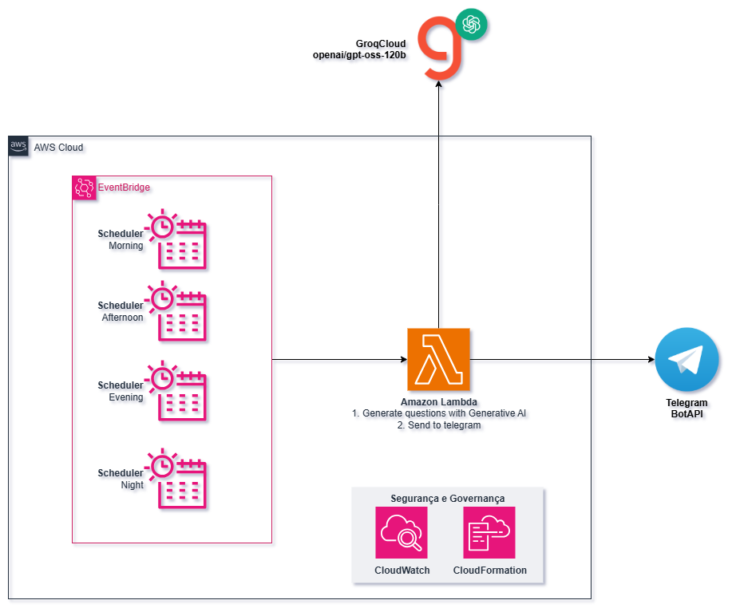

# AWS ML Associate Question Generator

> Gera automaticamente questões no estilo da certificação **AWS Certified Machine Learning Engineer – Associate (MLA-C01)** e envia para um grupo do Telegram, utilizando AWS Lambda, Serverless Framework e a API do Groq.

---

## Visão Geral

Este projeto automatiza a geração e envio de questões de prática para a certificação AWS ML Associate. Ele utiliza um modelo LLM hospedado na Groq para criar questões realistas, e envia as questões para um grupo do Telegram em horários programados via AWS Lambda.

---

## Arquitetura



> **Adicione o desenho da arquitetura no arquivo acima.**

---

## Como funciona?

- **Geração das questões:**
  - Um prompt customizado é enviado para a API da Groq, solicitando questões no formato do exame.
  - O modelo retorna questões, alternativas, resposta correta e explicações.
- **Envio para Telegram:**
  - As questões são formatadas e enviadas para o grupo do Telegram via bot.
- **Agendamento:**
  - O envio é feito automaticamente em horários pré-definidos usando eventos CloudWatch (cron) na AWS Lambda.

---

## Deploy

1. **Pré-requisitos:**
   - AWS CLI configurado
   - Node.js e npm
   - Serverless Framework (`npm install -g serverless`)

2. **Configuração das variáveis de ambiente:**
   - Crie um arquivo `.env` com:
     ```env
     GROQ_API_KEY=xxxxxx
     TELEGRAM_BOT_TOKEN=xxxxxx
     TELEGRAM_CHAT_ID=xxxxxx
     ```

3. **Deploy:**
   ```bash
   sls deploy
   ```

---

## Variáveis de Ambiente

- `GROQ_API_KEY`: Chave de API do Groq (LLM)
- `TELEGRAM_BOT_TOKEN`: Token do bot do Telegram
- `TELEGRAM_CHAT_ID`: ID do grupo ou usuário no Telegram

---

## Agendamento (CloudWatch Events)

Os horários de envio das questões são configurados no `serverless.yml`:

- 08:30 (manhã)
- 12:30 (almoço)
- 18:00 (tarde)
- 00:00 (noite)

---

## Estrutura do Projeto

- `handler.py`: Função principal (Lambda)
- `serverless.yml`: Configuração do Serverless Framework
---

## Exemplo de Questão Gerada

```
Pergunta: Uma equipe de ciência de dados está desenvolvendo um pipeline de machine learning para detecção de fraude em tempo real usando múltiplos serviços AWS. O pipeline precisa ingerir dados de alta frequência de múltiplas fontes, realizar feature engineering complexo, treinar modelos com grandes volumes de dados históricos, e garantir que o modelo em produção seja monitorado quanto a drift de conceito e compliance regulatório. Considerando requisitos de escalabilidade, custo, governança e explicabilidade, qual das arquiteturas abaixo é a mais adequada?
Alternativas:
A) Utilizar AWS Glue para ingestão e transformação, SageMaker Pipelines para orquestração, SageMaker Model Registry para versionamento, SageMaker Model Monitor para monitoramento, e AWS CloudTrail para auditoria.
B) Utilizar Amazon Kinesis Data Streams para ingestão, AWS Lambda para feature engineering, SageMaker Batch Transform para inferência, e Amazon CloudWatch para monitoramento.
C) Utilizar Amazon EMR para ingestão e processamento, SageMaker para treinamento, endpoint real-time para inferência, e AWS Config para monitoramento.
D) Utilizar apenas Amazon SageMaker Studio para todo o fluxo, com scripts customizados para ingestão, processamento, treinamento e monitoramento.
Resposta correta: A
Explicação: A alternativa A utiliza serviços gerenciados e integrados para cada etapa crítica: Glue para ETL escalável, Pipelines para orquestração, Model Registry para governança, Model Monitor para monitoramento de drift e CloudTrail para compliance. As demais opções não cobrem todos os requisitos de escalabilidade, governança e explicabilidade de forma integrada.
```

---
